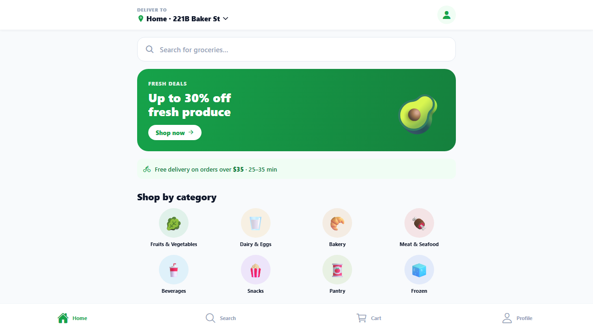

# 🛒 FreshCart — Grocery Delivery Demo

A polished, full-stack grocery / food-delivery demo built to show clients. **One
Expo codebase** produces both an **installable Android APK** and a **website**,
backed by a lightweight **Node/Express mock API**.

It's designed to feel like a real product, not a template: branded storefront,
48 real grocery products with photos and sale badges, animated cart, full
checkout flow, an order-tracking confirmation screen, **and a web admin console**
where the store owner manages products and orders — with changes that show up
live in the storefront.



---

## What's inside

```
demo ecommerce app/
├─ apps/mobile/      Expo (SDK 56) app → builds the APK AND the website
├─ packages/data/    @demo/data — shared catalog (8 categories, 48 products)
└─ mock-api/         Express mock backend (in-memory cart, orders, checkout)
```

**Tech:** Expo Router + React Native + react-native-web, TypeScript, React Query,
Zustand (persisted cart), Express. npm workspaces monorepo.

**Storefront screens:** Login / Sign up · Home · Category · Product detail ·
Search · Cart · Checkout · Order confirmation (with live tracker) · Profile.
**Account:** Edit profile · Delivery addresses (CRUD) · Payment methods · Favourites
· Notifications · Help & FAQ. Sign out returns to the login screen; logging in with
any email (or "Continue as guest") starts a session.

**Admin console (web-only):** Dashboard · Orders · Products · Offers & Discounts ·
Push Notifications · Banners · Delivery · Inventory · Staff · Customers · Analytics
· Settings. Product/price/stock edits, order-status changes, and push
notifications are live; the marketing, people, and analytics sections are richly
populated demo data.

**Push notifications (live):** In Admin → Push Notifications, compose a message
(title, body, category, audience) and **Send now** or **Schedule** for a future
time. The customer app polls the API every few seconds; a delivered notification
pops an in-app toast banner and lands in the bell-icon inbox (with unread count).
Scheduled ones appear automatically when their time arrives. No Firebase/APNs —
it's in-app delivery, perfect for demos.

### Offline-safe by design
The app tries the mock API first, then **falls back to the bundled catalog**. So
the installed APK shows a complete, working store **even with no server running**
— the cart and checkout work fully on-device. Run the API to get the "live"
experience on web.

---

## Run it (Windows / PowerShell, in VS Code)

### 0. Install once
```powershell
cd "C:\Users\iarha\OneDrive\Desktop\demo ecommerce app"
npm install
```

### 1. Start the mock API (terminal 1)
```powershell
npm run api          # http://localhost:4000
```

### 2. Start the website (terminal 2)
```powershell
npm run web          # opens http://localhost:8081
```
This is the day-to-day way to demo on a computer. Deep links and routing work
out of the box on the Expo dev server.

> The app reads the API URL from `apps/mobile/.env` (`EXPO_PUBLIC_API_URL`).
> It defaults to `http://localhost:4000`. Leave it blank to force the offline
> bundled catalog.

---

## Admin console

A store-owner dashboard, **web only**, at the `/admin` route:

```
http://localhost:8081/admin
```

You can also reach it from the storefront: **Profile tab → "Open store admin console"**.

| Page | What you can do |
|------|-----------------|
| **Dashboard** (`/admin`) | Live revenue, order count, average order value, orders-by-status, top products |
| **Products** (`/admin/products`) | Search, **add**, **edit** (price, sale price, stock, image, description), **delete** |
| **Orders** (`/admin/orders`) | See every order and advance its status: Confirmed → Preparing → Out for delivery → Delivered |

**It's live.** The admin writes to the same mock API the store reads from, so a price
change or a new product appears in the shopping app immediately (refresh the storefront
page). Order statuses you set in the admin show up on the customer's order-tracking screen.

Notes for the demo:
- The admin needs the **mock API running** (`npm run api`) — there's no offline fallback,
  because it performs writes. If the API is down it shows a "Can't reach the API" message.
- It's **web-only and not shipped in the APK** (opening `/admin` on a phone shows a
  "desktop-only" notice). Auth is omitted on purpose for the demo — in production these
  `/api/admin/*` endpoints would sit behind a login.
- All data is in-memory, so it resets when you restart the API.

---

## Build the Android APK (cloud — no Android SDK needed)

EAS Build compiles the APK in Expo's cloud, so you don't need the ~8 GB Android
toolchain locally.

```powershell
npm install -g eas-cli
eas login                      # create a free account at https://expo.dev
cd "C:\Users\iarha\OneDrive\Desktop\demo ecommerce app\apps\mobile"
eas build:configure            # accept creating the EAS project
eas build --platform android --profile preview
```

When it finishes, EAS prints a **download URL for the `.apk`** — send that to your
client, or install it directly on an Android phone. The `preview` profile is
already set to output an installable APK (`buildType: "apk"`,
`distribution: "internal"` in [`eas.json`](apps/mobile/eas.json)).

> **Tip:** to demo the APK with the live API, set `EXPO_PUBLIC_API_URL` to your
> machine's LAN IP (e.g. `http://192.168.1.20:4000`) before building. For a
> standalone APK to hand off, leave it blank — the bundled catalog keeps the
> store fully working offline.

---

## Publish the website

The web build is a static SPA — host it anywhere.

```powershell
cd "C:\Users\iarha\OneDrive\Desktop\demo ecommerce app\apps\mobile"
npm run export:web             # outputs apps/mobile/dist/
```

Deploy `dist/` to **Netlify**, **Vercel**, or **Cloudflare Pages** (drag-and-drop
works). These hosts auto-rewrite all routes to `index.html`, which a single-page
app needs.

> Testing `dist/` locally with a plain static server (`npx serve`) will 404 on
> direct deep links because it doesn't do SPA rewrites. For local testing, prefer
> `npm run web` (the dev server). For production, the named hosts handle it.

---

## API reference (mock)

Base URL `http://localhost:4000`

| Method | Path | Purpose |
|--------|------|---------|
| GET | `/api/categories` | List categories |
| GET | `/api/products?category=&q=&badge=&sort=` | List / filter products |
| GET | `/api/products/featured` | Bestsellers + new |
| GET | `/api/products/:id` | Product detail |
| GET | `/api/search?q=` | Search |
| GET / POST / PATCH / DELETE | `/api/cart...` | Cart operations |
| POST | `/api/checkout` | Place order (clears cart) |
| GET | `/api/orders` · `/api/orders/:id` | Order history |

**Admin (write) endpoints** — used by the console:

| Method | Path | Purpose |
|--------|------|---------|
| GET | `/api/admin/stats` | Dashboard metrics |
| POST | `/api/admin/products` | Create a product |
| PUT | `/api/admin/products/:id` | Update a product |
| DELETE | `/api/admin/products/:id` | Delete a product |
| PATCH | `/api/admin/orders/:id/status` | Advance an order's status |

State is in-memory and resets when the server restarts.

---

## Customising for a client

- **Products / categories:** edit [`packages/data/src/products.ts`](packages/data/src/products.ts)
  and [`categories.ts`](packages/data/src/categories.ts). Both the API and the app
  read from here.
- **Branding:** app name, colors, and package id live in
  [`apps/mobile/app.json`](apps/mobile/app.json). The accent green and spacing
  tokens are in [`apps/mobile/src/theme/index.ts`](apps/mobile/src/theme/index.ts).
- **App icon / splash:** replace the PNGs in `apps/mobile/assets/images/`.
- **Offline product photos:** drop optimized images into
  `apps/mobile/assets/products/<imageKey>.jpg` and register them in
  [`apps/mobile/src/lib/images.ts`](apps/mobile/src/lib/images.ts) so they ship
  inside the APK (no network needed).

---

*Demo build. Payments, auth, and persistence are simulated.*
